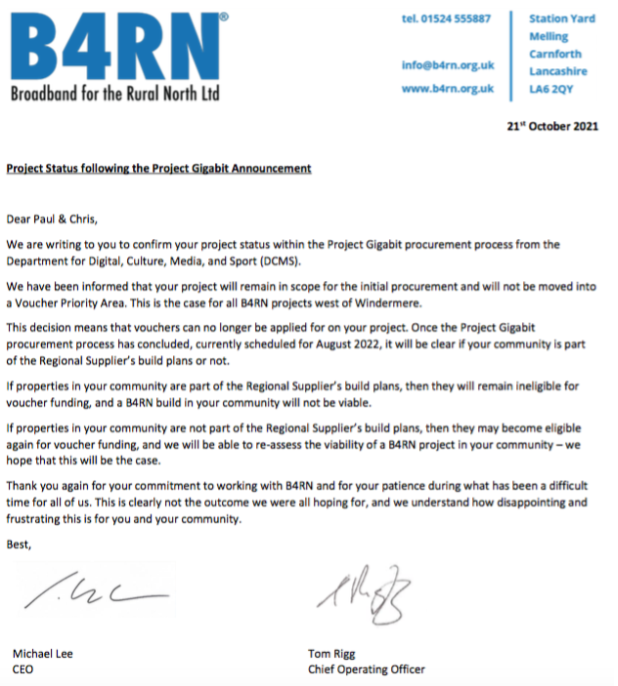

A week ago we received a letter from B4RN outlining our __Project Status following the Project Gigabit Announcement__. The letter is reproduced below.

This isn't the greatest news for the __b4brathay__ Project. In summary it says that DCMS have in effect paused any further eligibility for Gigabit Voucher support on all of B4RN's projects west of Windermere.

DCMS are instead [looking to contract with a single regional supplier](https://www.gov.uk/government/publications/project-gigabit-phase-one-delivery-plan/project-gigabit-phase-one-delivery-plan#appendix-a----regional-procurement-boundaries) to cover the west of Cumbria. The initial negotiation of this contract will not happen until August 2022. Implementation may then happen in phases over a number of years after that. If a regional supplier is not contracted for our area then we may again become eligible for voucher funding.

This isn't the outcome we wanted as B4RN stood ready to start connecting properties in our area as soon as we were ready to take the project forward on the ground. Despite the best efforts of [our local MP](https://timfarron.co.uk/en/article/2021/1413640/mp-secures-parliamentary-debate-to-back-b4rn-in-cumbria) and [B4RN management](https://b4rn.org.uk/b4rn-service/projectgigabit/), DCMS have rejected any further support for B4RN in our area pending the outcome of the regional supplier procurement process.

This leaves the __b4brathay__ Project in uncharted territory. 

One thing we do know is that 122 Gigabit Vouchers - worth about £0.25M - have been fully issued by DCMS for our revised project area. So we would like to thank those of you who took the process this far. We understand that these vouchers remain valid and commit DCMS to provide this funding if a way can be found to take the project forward.

Community investment (via the [purchase of B4RN shares](https://b4rn.org.uk/community/investors/)) was always going to be part of the overall project funding. But with no prospect of additional vouchers during the 12 months of any project build, the challenge of raising the necessary community investment becomes more acute.

We have spent the last week trying to establish the full implications of the letter and what, if any, the parameters are that would allow us to carry forward the __b4brathay__ Project in this new environment. These discussions are not yet complete but we recognise the need to determine this quickly and decisively.

We will contact you again, hopefully within a week, when we have a clearer picture of the implications and the ways forward.

On behalf of the __b4brathay__ Project team,

Rob & Paul

.

