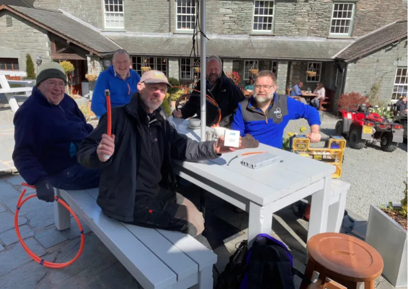

It has been well over a month since we were last in touch. Our request for additional volunteers has seen the "first line" __b4brathay__ Project team expand to include:

Christopher Fox
Andrew Baxter
Rob Pickering
Marian Hobart
James Wilkinson

You can see some of them in the photo below during a "duct training" session led by Dan Robinson from B4RN at the Three Shires Inn last Wednesday. This was also the first time that the team has been able to meet face-to-face.

.

The various diameters of orange tubing eventually contain the optic fibre that is "blown" down the duct. Orange duct is used underground but black (UV-resistant) duct is used above ground. On the table you can see the grey box that is installed on an external wall on your property - and the smaller white box (being held) that sits on your internal wall.

We've also been busy contacting local landowners (including the National Trust and the Lakeland Housing Trust) about wayleaves and discussing with our "second line" team (Richard Bowness and John Birkett) the best routes for the optic fibre ducting.

In a nutshell the __b4brathay__ Project can move from the current planning stage to the build stage when:

 * all the necessary wayleaves are acquired
 * enough community investment has been forthcoming

The final project cost will be known once the core network routes are finalised. There is likely to be a shortfall between the final project cost and the amount of government voucher funding available. This shortfall is met by community investment in B4RN shares (as has been done on all other B4RN projects to date).

B4RN currently offers a 5% annual return on any shares that are purchased. There is no obligation to purchase shares (and you should seek independent financial advice before doing so). Anyone may purchase B4RN shares (you don't have to be using B4RN services) and also donate their free connection entitlement to whoever they wish.

We'll have more to say about community investment in future newsletters but for the moment, if you want to get cracking, then please don't forget to check the box in Section 1 and specify "Skelwith and Little Langdale" as the community name in the B4RN Share Application Form.

Best wishes,

Chris and Paul

